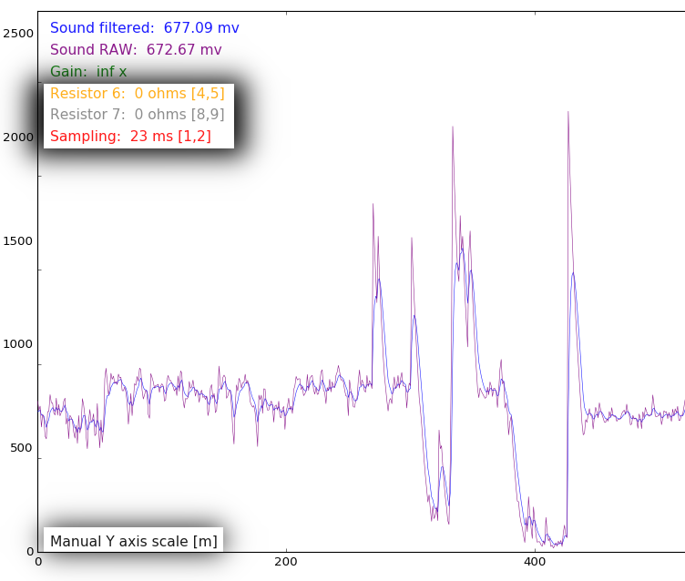

# SCK sound testing

A firmware for the Smart Citizen Kit that outputs via serial port a comma separated list of values related to the noise sensor, and a python script to plot this values in real time and save them to a csv file.

## Output from the kit
* Filtered Noise signal (calculated with [MegunoLink Exponential Filter Library](http://www.megunolink.com/documentation/arduino-libraries/exponential-filter/))
* Raw Noise signal
* Gain (calculated with the two resistor values)
* Resistor 6 value
* Resistor 7 value
* Milliseconds since last output

Also there is a python script that receives the kit output and plot's the data in real time:


## Changing kit values

You can ask the kit to **change the values** that have an associated key by pressing it or (only for numerical values) by scrolling the mouse wheel over the text that shows it's values.

And accepts inputs for modifying this values:
* **5** > resistor 6 value **UP**
* **4** > resistor 6 value **Down**
* **9** > resistor 7 **UP**
* **8** > resistor 7 **Down**
* **1** > Plus one millisecond of pause between readings
* **2** > Less one millisecond of pause between readings



## CSV data logging

The script saves all the received readings to a CSV file for later processing, inserting a time stamp in the first field. The logging is made averaging all received values between a time period (_defaults to 0.5 seconds_) specified in the variable `textRefreshTime` in line 86 of the python script.


## Manipulating data log and display

You can modify how the data is processed and displayed by changing some simple values in the python script:


The `sensor` list contains one entry per sensor received with some configurable parameters:

```python=
SCKSensor("Name", "unit", decimalDigits, "color", displayPlot=True, displayText=True, logValue=True, keys=['a', 'b', 'ctrl+e'])
```
* **Name:** _str_ This is the displayed and saved (csv) name for the first data received in the comma separated values that the Kit sends.
* **Unit:** _str_ The unit
* **decimalDigits** _int_ Number of digital decimals for this sensor
* **Color** _str_ The color to be showed. More info on [matplotlib docs](http://matplotlib.org/api/colors_api.html)
* **displayPlot** _bool_ Should the data be displayed as a plot?
* **displayText** _bool_ Should the data be displayed as text?
* **logValue** _bool_ Should we save the data to a csv file?
* **keys** _list_ Keys that can be used to modify this data value (they are send to the kit)


